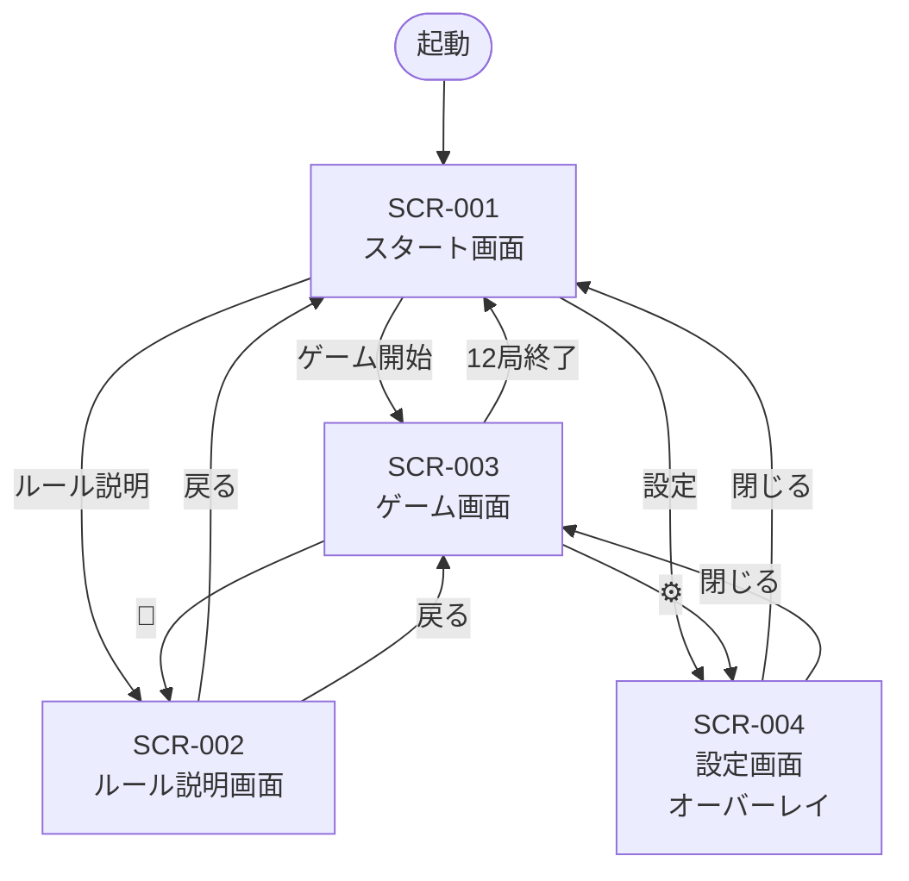

# 花合わせ（HANA AWASE）画面遷移仕様書

**v1.0　2026年5月22日**　© 2026 Hitonomigi Inc.

---

## 1\. 画面一覧

| 画面ID | 画面名 | 概要 |
| :---- | :---- | :---- |
| SCR-001 | スタート画面 | 起動時の初期画面。ゲーム開始・ルール説明・設定へ遷移 |
| SCR-002 | ルール説明画面 | ルール・札一覧・操作方法・役一覧をタブ表示 |
| SCR-003 | ゲーム画面 | メインのゲームプレイ画面 |
| SCR-004 | 設定画面 | 花札デザイン・背景を選択するオーバーレイ |

---

## 2\. 画面遷移図

---

## 3\. 遷移詳細

### SCR-001 スタート画面

| 操作 | 遷移先 | 備考 |
| :---- | :---- | :---- |
| ゲーム開始ボタン | SCR-003 | 新規ゲームを開始 |
| ルール説明ボタン | SCR-002 | 遷移元=SCR-001として記憶 |
| 設定ボタン | SCR-004 | オーバーレイ表示。遷移元=SCR-001として記憶 |

**遷移元：** 起動時 / SCR-003（12局終了後）

---

### SCR-002 ルール説明画面

| 操作 | 遷移先 | 備考 |
| :---- | :---- | :---- |
| 戻るボタン | 遷移元 | SCR-001 または SCR-003 |

**遷移元：** SCR-001 / SCR-003

---

### SCR-003 ゲーム画面

| 操作 | 遷移先 | 備考 |
| :---- | :---- | :---- |
| 📖ボタン | SCR-002 | 遷移元=SCR-003として記憶 |
| ⚙ボタン | SCR-004 | オーバーレイ表示。遷移元=SCR-003として記憶 |
| 12局終了 | SCR-001 | ゲーム終了後、スタート画面へ戻る |

**遷移元：** SCR-001（ゲーム開始）

---

### SCR-004 設定画面（オーバーレイ）

| 操作 | 遷移先 | 備考 |
| :---- | :---- | :---- |
| 閉じるボタン（変更なし） | 遷移元 | SCR-001 または SCR-003 |
| 閉じるボタン（変更あり） | 遷移元 | 確認ダイアログ表示後、遷移元へ戻る |

**遷移元：** SCR-001 / SCR-003

---

## 4\. 遷移元の記憶ルール

SCR-002・SCR-004 は呼び出し元を記憶し、戻るボタン・閉じるボタンで元の画面に戻る。

| 呼び出し元 | 戻り先 |
| :---- | :---- |
| SCR-001から開いた場合 | SCR-001 |
| SCR-003から開いた場合 | SCR-003 |

